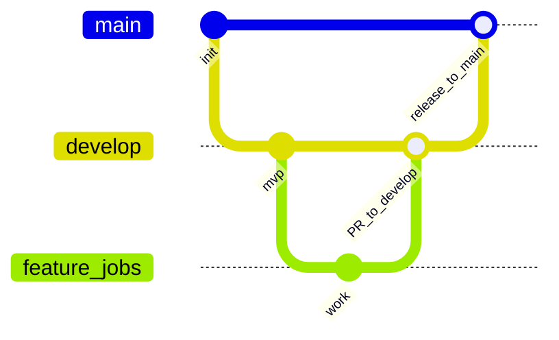

# Contributing — Git workflow

Job Talentio uses a simplified **Git Flow** with two long-lived branches.

Remote: [EGI-HOLDING/job-talentio](https://github.com/EGI-HOLDING/job-talentio)

## Branches

| Branch | Purpose |
|--------|---------|
| `develop` | Default integration branch (staging) |
| `main` | Production |

All day-to-day work lands on `develop` via Pull Request. Production releases promote `develop` → `main`.



## Branch naming

| Type | Pattern | Example |
|------|---------|---------|
| Feature | `feature/<name>` | `feature/cv-parser-import` |
| Bug fix | `fix/<name>` | `fix/chat-contrast` |
| Chore | `chore/<name>` | `chore/ci-cache` |
| Hotfix | `hotfix/<name>` | `hotfix/login-500` |

Keep names short, kebab-case, and descriptive.

## Developer loop

```bash
# 1) Sync staging
git checkout develop
git pull origin develop

# 2) New branch
git checkout -b feature/my-change

# 3) Work, commit, push
git add -A
git commit -m "feat: describe why this change exists"
git push -u origin HEAD

# 4) Open PR targeting develop
gh pr create --base develop --title "feat: my change" --body "## Summary
- ...
## Test plan
- [ ] ..."
```

## Pull request rules

- **Base branch for features/fixes:** `develop`
- **Base branch for production release:** `main` (from `develop`)
- CI must be green (typecheck / test / build)
- Prefer **squash merge** for feature PRs
- Delete the branch after merge
- Do not merge your own PR without review when another teammate is available

## Release (`develop` → `main`)

1. Confirm staging is healthy (Railway staging auto-deploys from `develop`).
2. Open PR: `develop` → `main`.
3. Merge (merge commit or squash — team choice; document in the PR). Railway **production** auto-deploys from `main`.
4. Optionally tag: `git tag v0.1.0 && git push origin v0.1.0`.

Deploy runbooks (domains, env vars, Hobby limits): [infra/README.md](infra/README.md).

## Hotfix (production)

1. `git checkout main && git pull`
2. `git checkout -b hotfix/urgent-fix`
3. Fix → PR into `main`
4. After merge, also merge `main` back into `develop` (or cherry-pick) so staging stays aligned.

## Protected branches (recommended on GitHub)

On GitHub → Settings → Branches, protect `main` and `develop`:

- Require pull request before merging
- Require status checks (CI) to pass
- Restrict force pushes
- For `main`: optionally require 1 approval

## What not to do

- Commit or push straight to `main` / `develop`
- Force-push protected branches
- Commit secrets (`.env`, credentials) — use `.env.example` only
- Open feature PRs directly against `main`
