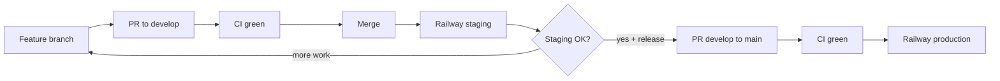
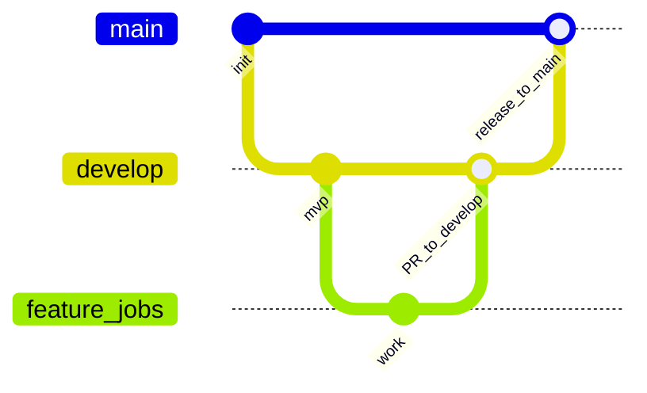

# Contributing — Development lifecycle

Job Talentio uses a simplified **Git Flow** with CI/CD into Railway.

Remote: [EGI-HOLDING/job-talentio](https://github.com/EGI-HOLDING/job-talentio)

## Environments

| Env | Branch | How it runs | URLs |
|-----|--------|-------------|------|
| Local | feature branch | Docker Compose + `pnpm dev` | `localhost:3000` / `3001` / `4000` |
| Staging | `develop` | Railway auto-deploy + Cloudflare | [staging.jobtalent.io](https://staging.jobtalent.io), [admin-staging…](https://admin-staging.jobtalent.io), [api-staging…/api/health](https://api-staging.jobtalent.io/api/health) |
| Production | `main` | Railway auto-deploy + Cloudflare | `jobtalent.io`, `admin.jobtalent.io`, `api.jobtalent.io` |

Full deploy runbook (env vars, Hobby limits, SMTP/R2): [infra/README.md](infra/README.md).

## Lifecycle (required)



1. Branch from up-to-date `develop`.
2. Implement + validate locally (typecheck / relevant smoke).
3. Open PR → **`develop`** with Summary + Test plan.
4. **CI must be green** (`.github/workflows/ci.yml`).
5. Merge → confirm staging deploy + smoke the surfaces you changed.
6. Promote to production only via PR **`develop` → `main`** when staging is healthy.

## Branches

| Branch | Purpose |
|--------|---------|
| `develop` | Integration / staging |
| `main` | Production |



## Branch naming

| Type | Pattern | Example |
|------|---------|---------|
| Feature | `feature/<name>` | `feature/cv-parser-import` |
| Bug fix | `fix/<name>` | `fix/chat-contrast` |
| Chore | `chore/<name>` | `chore/ci-cache` |
| Hotfix | `hotfix/<name>` | `hotfix/login-500` |

Keep names short, kebab-case, and descriptive.

## Developer loop

```bash
# 1) Sync staging branch
git checkout develop
git pull origin develop

# 2) New branch
git checkout -b feature/my-change

# 3) Work, commit, push
git add -A
git commit -m "feat: describe why this change exists"
git push -u origin HEAD

# 4) Open PR targeting develop
gh pr create --base develop --title "feat: my change" --body "## Summary
- ...
## Test plan
- [ ] Local smoke
- [ ] CI green
- [ ] Staging verify after merge (if user-facing / API / deploy)
"
```

## CI

GitHub Actions (`.github/workflows/ci.yml`) runs on pushes/PRs to `main` and `develop`:

- `pnpm install`
- Build `@job-talentio/shared`
- Prisma generate
- `pnpm typecheck`
- `pnpm test`
- `pnpm build`

Do not merge with failing checks. Fix on the same PR branch.

## Pull request rules

- **Base for features/fixes/chores:** `develop`
- **Base for production release:** `main` (from `develop`)
- CI must be green
- Prefer **squash merge** for feature PRs
- Delete the branch after merge
- Do not merge your own PR without review when another teammate is available
- Call out DB migrations, env vars, `NEXT_PUBLIC_*`, and Dockerfile changes in the PR body

## Staging verification (after merge to `develop`)

Railway watches `develop` for `api` / `web` / `admin`. After deploy:

- [ ] `GET https://api-staging.jobtalent.io/api/health`
- [ ] Exercise the changed flow on https://staging.jobtalent.io
- [ ] If admin touched: https://admin-staging.jobtalent.io
- [ ] If schema changed: confirm migrate deploy succeeded on the API service

## Release (`develop` → `main`)

1. Staging is healthy and stakeholders agree to ship.
2. Open PR: `develop` → `main`.
3. CI green → merge. Railway **production** auto-deploys from `main`.
4. Smoke production health + critical paths.
5. Optionally tag: `git tag v0.1.0 && git push origin v0.1.0`.

## Hotfix (production)

1. `git checkout main && git pull`
2. `git checkout -b hotfix/urgent-fix`
3. Fix → PR into `main` → verify production
4. Merge/cherry-pick into `develop` so staging stays aligned

## Protected branches (recommended on GitHub)

On GitHub → Settings → Branches, protect `main` and `develop`:

- Require pull request before merging
- Require status checks (CI) to pass
- Restrict force pushes
- For `main`: optionally require 1 approval

## What not to do

- Commit or push straight to `main` / `develop`
- Force-push protected branches
- Skip CI or ship straight to production without staging when avoidable
- Commit secrets (`.env`, credentials) — use `.env.example` and Railway variables
- Open feature PRs directly against `main`
- Attach both apex and `www` as Railway custom domains (use Cloudflare redirect for `www`)
