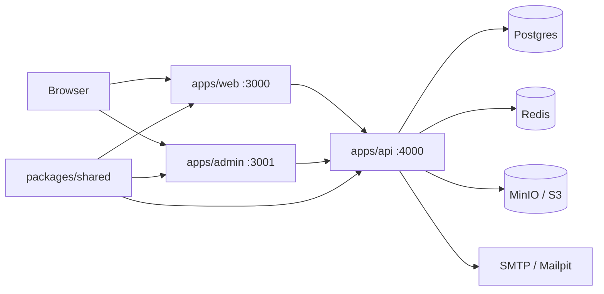

# Peta program Job Talentio

Job Talentio adalah **monorepo MVP job portal Uzbekistan** dengan 3 surface + shared package.

## Struktur repo

| Path | Isi |
|------|-----|
| [apps/api](../apps/api) | NestJS + Prisma — auth, jobs, profiles, ATS, billing, chat, admin |
| [apps/web](../apps/web) | Next.js portal — employee + recruiter |
| [apps/admin](../apps/admin) | Next.js Super Admin (1 halaman utama) |
| [packages/shared](../packages/shared) | Zod schemas & constants bersama |
| [docker](../docker) | Postgres, Redis, MinIO, Mailpit lokal |
| [infra](../infra) | Deploy Railway / Cloudflare / staging docs |
| [JOBTALENTIO-DUMMY.md](../JOBTALENTIO-DUMMY.md) | Akun seed demo (recruiter/employee/admin) |

## Backend modules

Entry: [apps/api/src/app.module.ts](../apps/api/src/app.module.ts)

| Module | Peran |
|--------|--------|
| Auth | Login/register JWT |
| Jobs | Search, publish, hot boost, questions |
| Profiles | CV upload/parse, skills, experience |
| Applications | Apply + pipeline ATS |
| Companies | Company pages/members |
| Billing | Plans + mock payment |
| Chat | Socket.IO conversations |
| Alerts | Job alerts (Redis worker) |
| Matching | Job/candidate match scores |
| Notifications | In-app notifications |
| Reports | User reports |
| Admin | Super-admin moderation APIs |
| Meta | Lookups (skills, cities, benefits, …) |
| Storage | S3/MinIO uploads |
| Mail | SMTP / Mailpit |

Data model inti: [apps/api/prisma/schema.prisma](../apps/api/prisma/schema.prisma) — `User`, `Company`, `JobPost`, `EmployeeProfile`, `Application`, `Resume`, `Subscription`, `ChatMessage`, dll.

## Frontend web (pages)

| Route | Peran |
|-------|--------|
| `/` | Home |
| `/jobs`, `/jobs/[id]` | Job search & detail |
| `/login`, `/register` | Auth |
| `/dashboard/employee` | Employee dashboard |
| `/dashboard/recruiter` | Recruiter / ATS dashboard |
| `/companies/[slug]` | Company public page |
| `/candidates/[id]` | Candidate profile (recruiter) |
| `/messages` | Chat |
| `/settings` | Account settings |

## Admin

Satu surface utama di [apps/admin/src/app/page.tsx](../apps/admin/src/app/page.tsx): metrics, users, companies, jobs, flags, reports.

## Environments

### Local

| Surface | URL |
|---------|-----|
| Web | http://localhost:3000 |
| Admin | http://localhost:3001 |
| API | http://localhost:4000/api |
| Mailpit | http://localhost:8025 |
| MinIO console | http://localhost:9001 |

### Staging (`develop` → Railway)

| Surface | URL |
|---------|-----|
| Web | https://staging.jobtalent.io |
| Admin | https://admin-staging.jobtalent.io |
| API | https://api-staging.jobtalent.io |
| API health | https://api-staging.jobtalent.io/api/health |

Seed demo (password non-admin: `Password123!`): [JOBTALENTIO-DUMMY.md](../JOBTALENTIO-DUMMY.md).

Deploy checklist: [infra/README.md](../infra/README.md).

## Area kerja umum (untuk perubahan berikutnya)

1. **UX/UI web** — jobs list, filters, dashboard, i18n  
2. **API / jobs / matching** — search, ranking, apply flow  
3. **Profile / CV** — upload MinIO, parser, completeness  
4. **Recruiter ATS** — pipeline, candidates  
5. **Admin** — moderation, plans  
6. **Infra / staging** — SMTP, R2, production cutover  
7. **Seed / data** — akun dummy, konten demo  

Setiap perubahan: branch `feature/*` atau `fix/*` → PR ke **`develop`** (lihat [CONTRIBUTING.md](../CONTRIBUTING.md)).
